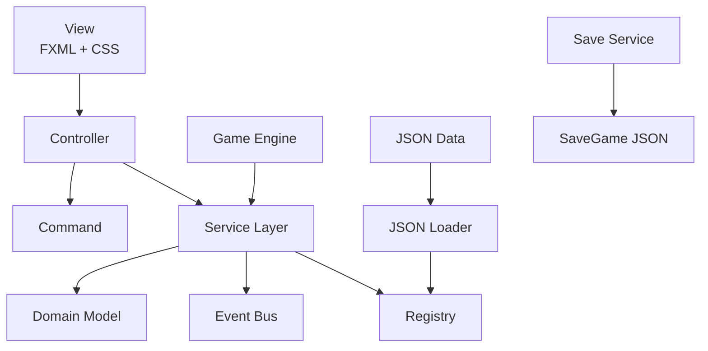
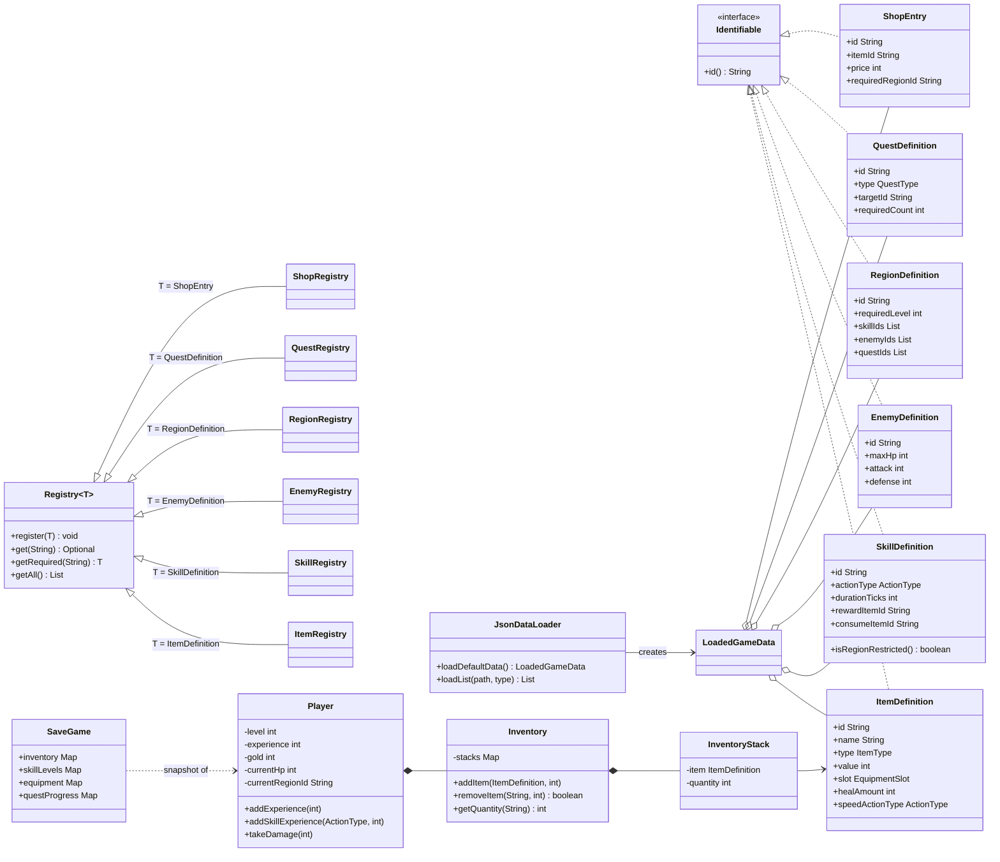
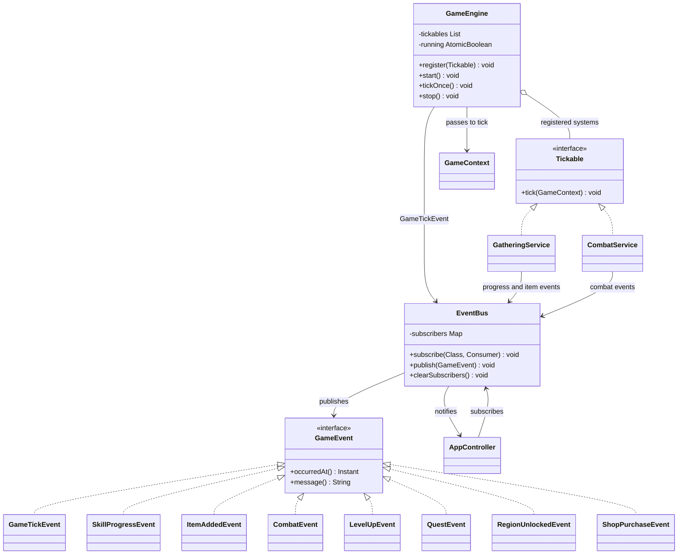
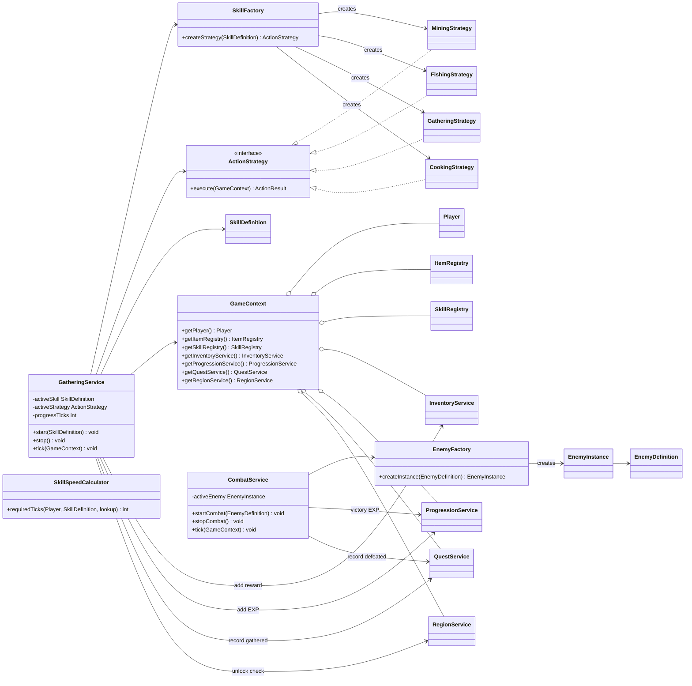
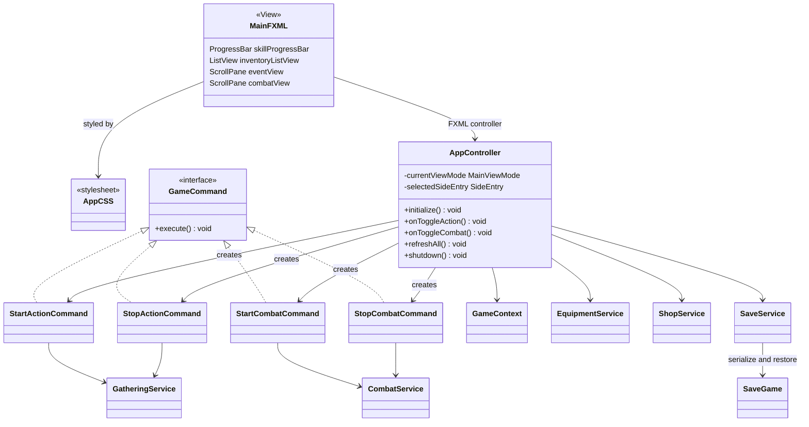
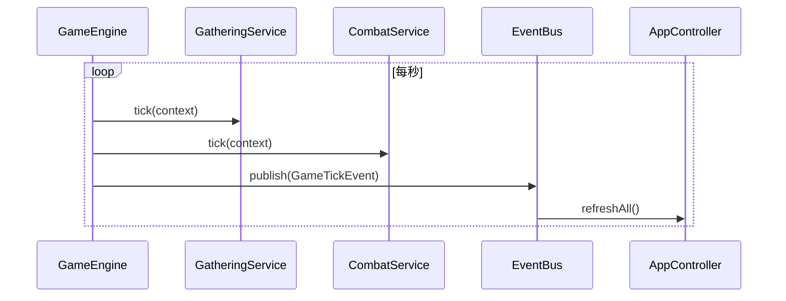

# Idle RPG Framework 期末專題書面報告

## 基於 MVC、事件驅動與資料驅動設計之可擴充放置型角色扮演遊戲

| 項目   | 內容                 |
|------|--------------------|
| 系級   | 資訊三丁               |
| 姓名   | 游仁忠、楊柏宇            |
| 學號   | D1256977、D1227477  |
| 專題名稱 | Idle RPG Framework |

---

## 摘要

本專題實作一套以 Java 26 與 JavaFX 開發的 Idle RPG Framework。專題參考放置型角色扮演遊戲的操作方式，但重點並非複製特定遊戲內容，而是設計一套低耦合、可維護、可測試且能持續擴充的遊戲架構。

系統採用 MVC、Service Layer、Event Bus、Registry、Factory、Strategy、Command 與 Tick-Based Engine。道具、技能事件、敵人、區域、任務與商店商品由 JSON 載入，使遊戲內容與核心程式分離。玩家可進行採礦、釣魚、採集、烹飪、戰鬥、裝備、商店交易、任務與地圖解鎖，並具有本機存檔功能。

介面使用 FXML 與 JavaFX CSS 製作深色系三欄式遊戲畫面。左側顯示玩家能力與事件，中央顯示目前選取的主要功能，右側提供可互動的文字背包，底部則保留戰鬥、裝備、任務、地圖與商店等全域功能。專案目前包含 67 個主要 Java 類別、14 個測試類別及 6 份遊戲資料 JSON，並已通過 23 個自動化測試。

**關鍵字：** JavaFX、MVC、Idle RPG、Event-Driven Architecture、Data-Driven Design、Design Patterns

---

## 一、動機

一般小型遊戲專案容易將畫面事件、遊戲規則與資料直接寫在同一個類別中。這種方式在功能少時開發快速，但新增技能、敵人、地圖或任務後，會產生下列問題：

1. UI 直接修改玩家資料，難以追蹤狀態變化。
2. 新增內容時需要修改多個核心類別。
3. 採集、戰鬥、任務與背包彼此高度依賴。
4. 遊戲平衡數值硬編碼，調整內容必須重新修改 Java。
5. 缺乏測試介面，修改功能容易造成回歸錯誤。

因此，本專題將「放置型 RPG」視為展示軟體架構的應用情境，目標是建立可由 JSON 擴充內容、由 Service 管理規則、由 Event Bus 通知狀態變化的框架。

---

## 二、專題目標

本專題設定以下目標：

1. 建立可實際遊玩的放置型 RPG 核心循環。
2. 使用 MVC 分離畫面、控制流程與遊戲資料。
3. 使用 Event Bus 降低系統之間的直接依賴。
4. 使用 Registry 與 JSON 建立資料驅動內容。
5. 使用 Strategy 與 Factory 支援不同事件行為。
6. 使用 Tick Engine 統一採集與戰鬥更新。
7. 提供任務、地圖、裝備、商店與存檔。
8. 建立自動化測試，驗證核心規則。

本框架的可擴充範圍分為兩層：

- **內容擴充：** 使用既有類型新增道具、事件、敵人、任務、地圖或商品時，只需修改 JSON。
- **行為擴充：** 新增全新事件類型時，需要增加 enum、Strategy、Factory 對應與 UI 顯示，再由 JSON 建立實際內容。

此界線避免誇大「完全不修改程式即可加入任何功能」，也使框架責任更清楚。

---

## 三、開發環境與技術

| 類別 | 使用技術 |
|---|---|
| 程式語言 | Java 26 |
| GUI | JavaFX 26 |
| 版面配置 | FXML |
| 視覺樣式 | JavaFX CSS |
| 建置工具 | Maven |
| 資料格式 | JSON |
| JSON 函式庫 | Jackson 2.17.2 |
| 測試框架 | JUnit Jupiter 5.10.2 |
| UML | PlantUML |
| 主要 IDE | IntelliJ IDEA |

程式入口為：

```text
com.idlerpg.Launcher
```

`Launcher` 是一般 Java 類別，負責呼叫 JavaFX `Application`，可避免直接執行 `Main` 時出現 JavaFX runtime components missing。

---

## 四、需求分析

### 4.1 功能需求

系統需提供：

- 玩家等級、經驗、生命、金幣、攻擊與防禦。
- 採礦、釣魚、採集與烹飪事件。
- 事件時間條、技能經驗與技能等級。
- 消耗材料後產生獎勵的加工事件。
- 自動戰鬥、敵人防禦、勝敗與獎勵。
- 背包分類、道具詳情、食用、刪除與出售。
- 武器、防具、工具與飾品欄位。
- 任務追蹤與獎勵領取。
- 區域解鎖與區域內容切換。
- 商店購買及批量出售。
- 本機存檔與載入。

### 4.2 非功能需求

- 核心邏輯不得直接依賴 JavaFX 控制項。
- View 不直接修改 domain state。
- 遊戲資料應從 JSON 載入。
- 重複 id 必須被 Registry 拒絕。
- 核心 Service 必須可在無 GUI 環境下測試。
- UI 在較小視窗中仍應可捲動操作。
- 玩家畫面不顯示工程用 Event Log。

---

## 五、系統架構

### 5.1 分層架構



各層責任如下：

| 層級 | 責任 |
|---|---|
| View | 顯示資料、接收點擊、呈現進度與狀態 |
| Controller | 將使用者操作轉換為 command 或 service 呼叫 |
| Service | 執行採集、戰鬥、任務、商店、裝備與存檔規則 |
| Domain | 保存玩家、道具、技能、敵人、任務等狀態 |
| Core | 提供 Event Bus、Tick Engine、Registry 與 Loader |
| Data | 以 JSON 定義遊戲內容 |

### 5.2 MVC

本專題的 Model 不只是一個資料類別，而是由 Domain 與 Service 共同構成：

- `Player`、`Inventory`、`SkillDefinition` 等保存狀態。
- `GatheringService`、`CombatService` 等執行規則。
- `AppController` 負責協調 JavaFX 畫面與服務。
- `main.fxml` 與 `app.css` 負責畫面結構及視覺樣式。

這樣可避免 Controller 累積所有遊戲計算，也能讓 Service 在測試中獨立執行。

### 5.3 UML 關係圖例

以下類別圖使用的關係符號：

| 符號 | 關係 | 說明 |
|---|---|---|
| `<|..` | 實作 | 類別實作 interface |
| `<|--` | 繼承 | 子類別繼承父類別 |
| `*--` | 組合 | 內部物件的生命週期由擁有者管理 |
| `o--` | 聚合 | 物件被集中管理，但可獨立存在 |
| `-->` | 依賴或使用 | 呼叫、建立或傳遞另一個物件 |

### 5.4 Domain、JSON 與 Registry 類別圖

此圖說明內容定義如何由 JSON 載入，再交給各類 Registry 以 id 管理；同時呈現 Player、Inventory 與 SaveGame 的狀態關係。



### 5.5 Event Bus 與 Tick Engine 類別圖

此圖呈現 Event Bus 的 Observer 實作，以及 GameEngine 透過 `Tickable` 同時更新採集與戰鬥系統的方式。



### 5.6 Service、Factory 與 Strategy 類別圖

此圖說明採集與戰鬥系統的主要協作關係。`GameContext` 提供各 Service 所需的 Player、Registry 與其他服務，避免核心邏輯依賴 JavaFX。



### 5.7 View、Controller 與 Command 類別圖

此圖呈現 JavaFX View 只透過 Controller 發出操作，Controller 再以 Command 或 Service 執行規則。



---

## 六、核心模組

### 6.1 Event Bus

`EventBus` 提供：

```java
subscribe(Class<E>, Consumer<E>)
publish(GameEvent)
```

系統事件包含：

- `GameTickEvent`
- `SkillProgressEvent`
- `ItemAddedEvent`
- `CombatEvent`
- `LevelUpEvent`
- `QuestEvent`
- `RegionUnlockedEvent`
- `ShopPurchaseEvent`

Controller 訂閱共同的 `GameEvent`，再將重要事件轉換為玩家可理解的短暫提示。一般 tick 與每次攻擊不會全部顯示，避免玩家看到除錯紀錄。

### 6.2 Registry

各種定義物件都實作 `Identifiable`，Registry 以 id 管理內容：

```text
ItemRegistry
SkillRegistry
EnemyRegistry
RegionRegistry
QuestRegistry
ShopRegistry
```

Registry 提供註冊、查詢與取得全部內容，並拒絕重複 id。Service 不需要自行掃描 JSON 或保存多份內容。

### 6.3 Factory 與 Strategy

`SkillFactory` 根據 `ActionType` 建立對應 Strategy：

```text
MINING    -> MiningStrategy
FISHING   -> FishingStrategy
GATHERING -> GatheringStrategy
COOKING   -> CookingStrategy
```

所有 Strategy 實作 `ActionStrategy`，並回傳 `ActionResult`。`GatheringService` 不需知道每種事件如何命名，只處理共通流程：

1. 推進時間。
2. 檢查材料。
3. 執行 Strategy。
4. 加入獎勵。
5. 增加玩家與技能經驗。
6. 更新任務及區域解鎖。

### 6.4 Command

Controller 使用 Command 封裝開始與停止操作：

```text
StartActionCommand
StopActionCommand
StartCombatCommand
StopCombatCommand
```

Command 讓 UI 操作與實際 Service 呼叫分開，未來可延伸快捷鍵、操作紀錄或重新綁定控制方式。

### 6.5 Tick Engine

`GameEngine` 每秒呼叫所有 `Tickable`：



目前 `GatheringService` 與 `CombatService` 都實作 `Tickable`。這使遊戲時間更新集中管理，未來也可加入 Buff、製作佇列或自動回復。

---

## 七、資料驅動設計

### 7.1 資料檔

| 檔案 | 數量 | 用途 |
|---|---:|---|
| `items.json` | 13 | 資源、食品、裝備 |
| `skills.json` | 10 | 採礦、釣魚、採集、烹飪 |
| `enemies.json` | 3 | 敵人能力與獎勵 |
| `regions.json` | 3 | 區域、解鎖條件與內容關聯 |
| `quests.json` | 6 | 採集及戰鬥任務 |
| `shop.json` | 3 | 區域商店商品 |

### 7.2 關聯方式

JSON 物件以 id 建立關聯。例如：

```text
skills.rewardItemId -> items.id
skills.consumeItemId -> items.id
regions.skillIds     -> skills.id
regions.enemyIds     -> enemies.id
regions.questIds     -> quests.id
shop.itemId          -> items.id
```

`JsonDataLoaderTest` 會驗證主要引用，避免啟動後才發現不存在的獎勵道具或事件。

### 7.3 消耗型事件

烹飪事件除了獎勵，也能定義材料：

```json
{
  "id": "cook_fish",
  "actionType": "COOKING",
  "durationTicks": 5,
  "rewardItemId": "cooked_fish",
  "rewardQuantity": 1,
  "expReward": 18,
  "consumeItemId": "river_fish",
  "consumeQuantity": 1,
  "regionRestricted": false
}
```

`regionRestricted: false` 表示此事件為全域事件，不必重複加入每張地圖。

---

## 八、遊戲功能實作

### 8.1 採集與技能成長

事件完成後會：

- 取得指定道具。
- 增加玩家經驗。
- 增加對應技能經驗。
- 推進收集任務。
- 檢查是否解鎖新區域。

每個 `ActionType` 有獨立技能等級與經驗。技能等級越高，事件時間會略微縮短。

### 8.2 工具速度

工具可指定：

```text
speedActionType
speedBonusPercent
```

`SkillSpeedCalculator` 將技能等級與工具加成合併，最多降低 90% 基礎時間。工具只影響相符的事件類型，不會增加戰鬥攻擊或防禦。

### 8.3 戰鬥

每個戰鬥 tick 的流程：

1. 玩家攻擊敵人。
2. 傷害為 `max(1, 玩家攻擊 - 敵人防禦)`。
3. 敵人未死亡時反擊。
4. 敵人傷害為 `max(1, 敵人攻擊 - 玩家防禦)`。
5. 勝利後獲得 EXP 與 Gold。
6. 戰敗時失去目前經驗的 50%，HP 回復至最大值的 50%。

### 8.4 背包、食品與裝備

背包以 item id 堆疊數量，支援：

- 依類型篩選。
- 查看稀有度、描述、價值與能力。
- 食用食品回復 HP。
- 裝備物品。
- 刪除或出售物品。

裝備欄位包含 `WEAPON`、`ARMOR`、`TOOL` 與 `TRINKET`。更換裝備時，舊裝備會回到背包。

### 8.5 任務與區域

目前實作：

- 收集道具任務。
- 擊敗敵人任務。
- 任務完成與領獎狀態。
- EXP、Gold、道具與區域解鎖獎勵。
- 等級與前置任務解鎖條件。

三個區域依序為：

1. 新手村。
2. 鐵脊山道。
3. 幽暗森林。

### 8.6 商店

商店內容由目前區域與 `shop.json` 共同決定。玩家可購買商品，也可切換出售模式，使用數量控制一次出售多個物品。

### 8.7 存檔

存檔預設位置：

```text
~/.idle-rpg-framework/save.json
```

存檔內容包含：

- 玩家等級、EXP、Gold、HP。
- 背包與裝備。
- 技能等級及技能 EXP。
- 任務進度與領獎狀態。
- 已解鎖區域與目前區域。

---

## 九、使用者介面設計

介面採深色系並參考桌面版放置遊戲的資訊分區：

1. **左側事件列：** 顯示 Attack、Health、Defence 與目前可用技能。
2. **中央單一主畫面：** 同一時間只顯示一個事件或功能，避免內容擁擠。
3. **右側文字背包：** 在尚未導入圖片素材時，使用名稱與數量維持辨識度。
4. **底部全域導覽：** 戰鬥、裝備、任務、地圖、商店可隨時切換。
5. **ScrollPane：** 中央頁面可捲動，避免視窗高度不足造成按鈕被裁切。
6. **Toast：** 只顯示重要獎勵、升級與任務結果，不顯示除錯事件列表。

採集與戰鬥都使用單一按鈕：

- `▶` 表示開始。
- `Ⅱ` 表示目前執行中，再次點擊即可停止。

---

## 十、測試與驗證

### 10.1 自動化測試

目前共有 14 個測試類別、23 個測試案例：

| 測試類別 | 驗證內容 |
|---|---|
| `EventBusTest` | 訂閱、發布與父型別事件 |
| `RegistryTest` | 註冊、查詢、重複 id |
| `JsonDataLoaderTest` | JSON 載入與資料引用 |
| `InventoryServiceTest` | 道具堆疊、移除與事件 |
| `GatheringServiceTest` | 採集、材料消耗、工具速度 |
| `CombatServiceTest` | 防禦、勝利、戰敗處理 |
| `SaveServiceTest` | 玩家、背包、任務與區域保存 |
| `RegionServiceTest` | 等級及任務解鎖 |
| `QuestServiceTest` | 任務進度與獎勵 |
| `ShopServiceTest` | 扣款與加入商品 |
| `EquipmentServiceTest` | 穿脫裝備與能力值 |
| `PlayerTest` | HP 回復上限 |
| `SkillSpeedCalculatorTest` | 技能及工具加速規則 |

### 10.2 靜態驗證

本次交付執行：

```text
javac --release 26
xmllint --noout main.fxml
JSON syntax validation
JUnit-compatible manual test runner
```

結果：

```text
主要程式編譯通過
測試程式編譯通過
FXML 格式通過
6 份 JSON 語法通過
23 / 23 tests passed
```

---

## 十一、開發問題與解決方式

### 11.1 JavaFX 啟動錯誤

直接執行 JavaFX `Application` 類別時，IDE 可能顯示 runtime components missing。解決方式是增加一般 Java 入口 `Launcher`，再呼叫 `Main.main()`。

### 11.2 時間條不平順

遊戲邏輯仍以每秒 tick 為準，但畫面使用 JavaFX `Timeline` 在 tick 之間補間，讓時間條平滑移動，同時不改變實際結算規則。

### 11.3 地圖選擇被刷新

區域切換後由 `RegionService` 更新 `Player.currentRegionId`，再由單一 `refreshAll()` 重新建立畫面，避免 ComboBox 或畫面暫存值覆蓋玩家狀態。

### 11.4 畫面內容被裁切

原本多個功能同時堆在中央，視窗高度不足時無法操作。重構後中央改為 StackPane 單頁切換，各頁使用 ScrollPane，底部導覽固定不參與捲動。

### 11.5 事件類型語意錯誤

藥草採集原本暫用 `FISHING`，導致左側分類與技能經驗不正確。新版增加 `GATHERING`、`GatheringStrategy` 與 Factory/UI 對應，使資料語意一致。

---

## 十二、專案成果

本專題完成的成果包括：

- 可操作的 JavaFX Idle RPG。
- MVC 與 Service Layer 分層。
- Event Bus 事件驅動架構。
- Tick-Based 採集與戰鬥系統。
- Registry、Factory、Strategy、Command 等模式。
- 六份 JSON 資料檔與資料載入器。
- 深色系三欄玩家介面。
- 任務、地圖、裝備、商店與存檔。
- PlantUML 架構文件。
- 23 個通過的自動化測試。
- 操作與內容擴充文件。

---

## 十三、限制與未來工作

目前版本仍有以下限制：

1. 尚未導入角色、怪物、道具與地圖圖片素材。
2. 事件類型仍需在編譯期加入 Strategy，尚未支援外部 plugin。
3. 存檔只有單一欄位，沒有多角色或版本遷移介面。
4. 戰鬥以固定每秒互相攻擊為主，尚未加入技能、狀態效果與掉落表。
5. 任務類型的資料模型已預留多種 enum，但目前內容主要展示採集與擊敗敵人。
6. 尚未進行長時間效能測試與跨平台打包。

未來可擴充：

- 圖片資產路徑與通用 ImageView 元件。
- 裝備品質、隨機屬性與掉落表。
- 製作佇列、伐木、鍛造與煉金。
- Buff、Debuff、技能冷卻與戰鬥動畫。
- 多存檔與存檔版本升級。
- Mod 或 Plugin API。
- jlink/jpackage 桌面應用程式封裝。

---

## 十四、結論

本專題證明放置型 RPG 不只能作為遊戲成品，也能作為軟體架構與物件導向設計的展示平台。透過 MVC、Service Layer 與 Event Bus，畫面和遊戲規則得以分離；透過 Registry、Factory 與 Strategy，不同行為具有共同介面；透過 JSON，內容數值與 Java 核心程式分離；透過自動化測試，採集、戰鬥、裝備、任務與存檔可被重複驗證。

最後成果不只是一組固定遊戲內容，而是一個能繼續加入事件、道具、敵人、任務與區域的 Idle RPG Framework。這也符合本專題最初目標：以可維護性、可擴充性與低耦合為核心，完成具備玩家體驗的桌面遊戲框架。

---

## 附錄 A：專案目錄

```text
final_prj/
├── pom.xml
├── docs/uml/
├── src/main/java/com/idlerpg/
│   ├── command/
│   ├── controller/
│   ├── core/
│   │   ├── engine/
│   │   ├── event/
│   │   ├── loader/
│   │   └── registry/
│   ├── domain/
│   ├── factory/
│   └── service/
│       ├── combat/
│       ├── equipment/
│       ├── gathering/
│       ├── inventory/
│       ├── progression/
│       ├── quest/
│       ├── region/
│       ├── save/
│       └── shop/
├── src/main/resources/
│   ├── data/
│   └── view/
└── src/test/java/
```

## 附錄 B：執行方式

IntelliJ IDEA：

```text
Main class: com.idlerpg.Launcher
JDK: 26
VM options: --enable-native-access=ALL-UNNAMED
```

若已安裝 Maven：

```bash
cd final_prj
mvn test
mvn javafx:run
```
