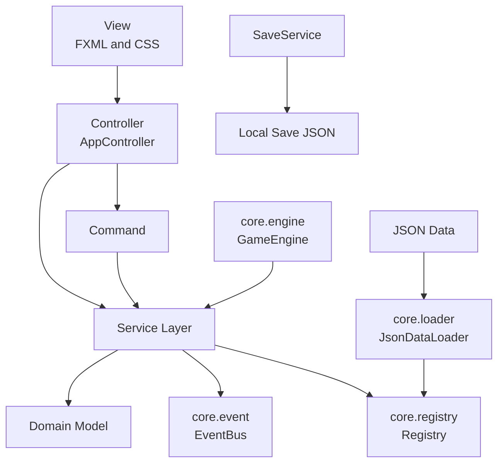
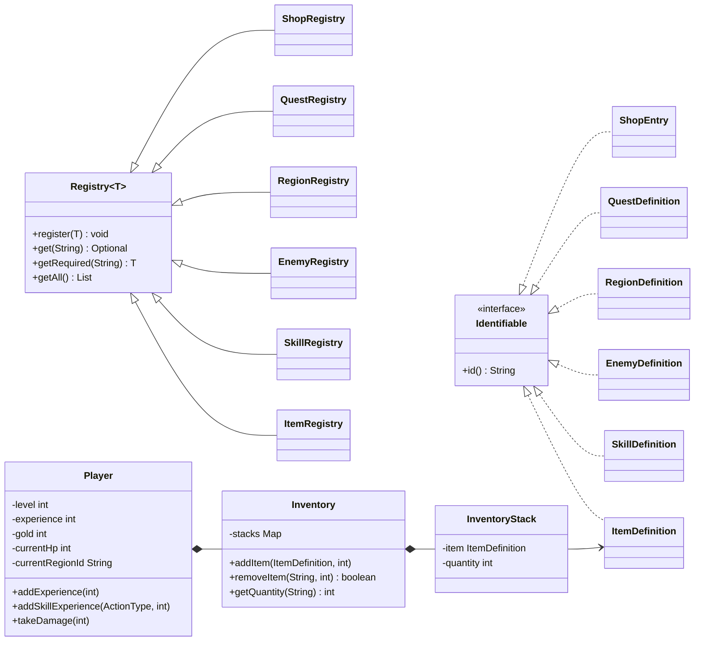
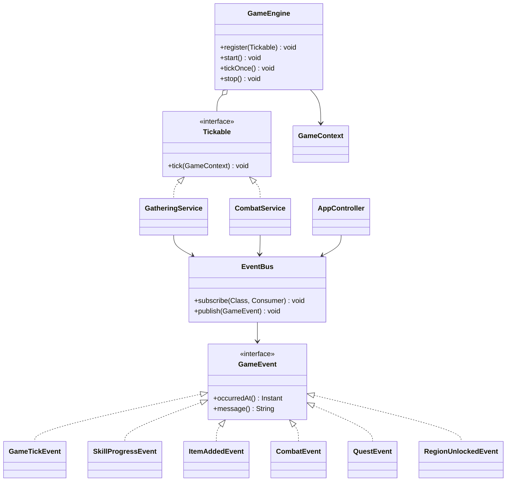
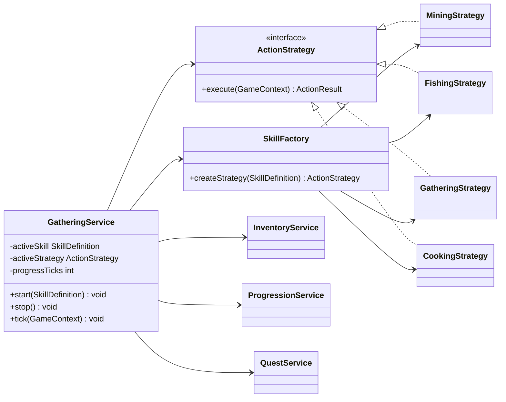
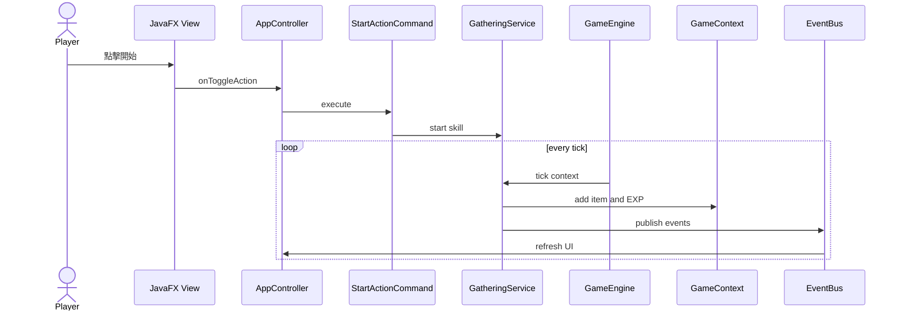
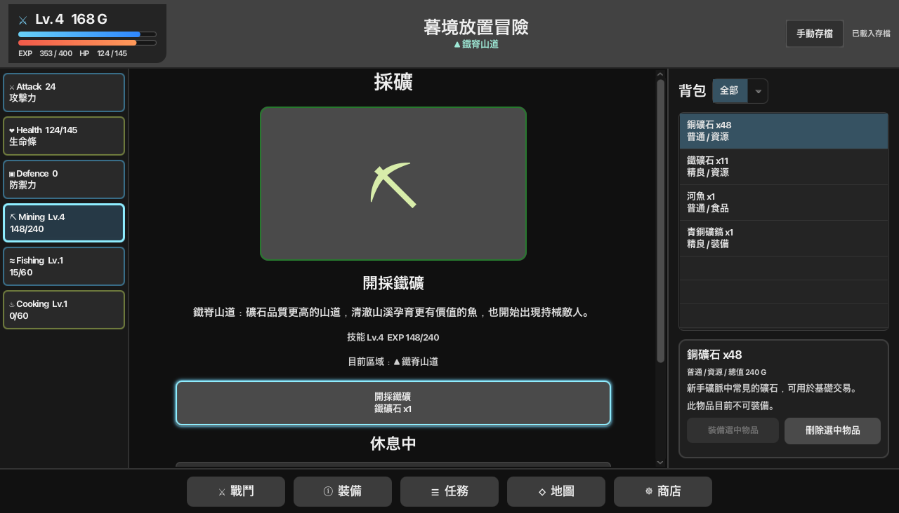

# Idle RPG Framework 期末專題報告（精簡版）

| 項目 | 內容 |
|---|---|
| 系級 | 資訊三丁 |
| 姓名 | 游仁忠、楊柏宇 |
| 學號 | D1256977、D1227477 |
| 開發語言 | Java 26 |
| GUI | JavaFX 26、FXML、CSS |
| 建置與測試 | Maven、JUnit Jupiter |

---

# 題目

## 基於 MVC、事件驅動與資料驅動設計之可擴充 Idle RPG Framework

本專題參考放置型角色扮演遊戲的玩法與介面結構，使用 Java 26 與 JavaFX 建立可實際遊玩的桌面應用程式。專題重點不是複製特定遊戲內容，而是建立具有以下特性的遊戲框架：

- 畫面與遊戲邏輯分離。
- 道具、事件、敵人、任務與地圖由 JSON 定義。
- 使用 Event Bus 傳遞狀態變化。
- 使用 Registry 與 Factory 管理遊戲內容。
- 使用 Strategy 呈現不同技能行為。
- 使用 Tick Engine 統一更新採集與戰鬥。
- 提供自動化測試與本機存檔。

玩家可執行採礦、釣魚、採集與烹飪，並使用戰鬥、背包、裝備、任務、地圖與商店系統完成基本遊戲循環。

---

# 設計方法概述

## 1. 分層設計

本專題以 MVC 為基礎，並加入 Service Layer、Event Bus、Registry 與 Tick Engine。

| 層級 | 專案內容 | 主要責任 |
|---|---|---|
| View | `main.fxml`、`app.css` | 顯示畫面、接收玩家輸入 |
| Controller | `AppController` | 將點擊操作轉成 Command 或 Service 呼叫 |
| Command | `StartActionCommand` 等 | 封裝開始與停止操作 |
| Service | Gathering、Combat、Quest 等 | 執行遊戲規則 |
| Domain | Player、Item、Skill 等 | 保存遊戲資料與狀態 |
| Core | Event、Engine、Registry、Loader | 提供框架級共用機制 |
| Data | `data/*.json` | 定義道具、技能、敵人、地圖與任務 |

## 2. Package UML



## 3. 主要類別 UML



## 4. Event Bus、Engine 與 Service UML



## 5. Factory 與 Strategy UML



## 6. 採集事件執行順序



## 7. 設計模式整理

| 設計方法 | 實作 | 效果 |
|---|---|---|
| MVC | FXML / AppController / Domain-Service | 分離畫面與遊戲邏輯 |
| Observer | EventBus | 系統間不需直接依賴 UI |
| Strategy | ActionStrategy | 不同事件共用同一執行介面 |
| Factory | SkillFactory、EnemyFactory | 集中建立物件 |
| Command | Start/Stop Command | 封裝玩家操作 |
| Registry | Registry<T> | 使用唯一 id 管理內容 |
| Service Layer | Gathering、Combat、Quest 等 | 將遊戲規則集中於可測試類別 |
| Data-Driven | JSON + Jackson | 內容數值與 Java 程式分離 |

---

# 程式、執行畫面及其說明

## 1. 專案結構

```text
final_prj/
├── pom.xml
├── docs/uml/
├── src/main/java/com/idlerpg/
│   ├── command/
│   ├── controller/
│   ├── core/
│   ├── domain/
│   ├── factory/
│   └── service/
├── src/main/resources/
│   ├── data/
│   └── view/
└── src/test/java/
```

目前主程式共 67 個 Java 檔案，測試共 14 個 Java 檔案。

## 2. 程式入口

JavaFX 主程式為 `Main`，另提供一般 Java 入口 `Launcher`：

```java
public final class Launcher {
    private Launcher() {
    }

    public static void main(String[] args) {
        Main.main(args);
    }
}
```

IntelliJ IDEA 執行設定：

```text
Main class: com.idlerpg.Launcher
JDK: 26
VM options: --enable-native-access=ALL-UNNAMED
```

`Launcher` 可避免將 JavaFX `Application` 當成一般類別執行時出現 runtime components missing。

## 3. JSON 載入與 Registry

```java
LoadedGameData data = new JsonDataLoader().loadDefaultData();

ItemRegistry itemRegistry = new ItemRegistry();
SkillRegistry skillRegistry = new SkillRegistry();
EnemyRegistry enemyRegistry = new EnemyRegistry();

data.items().forEach(itemRegistry::register);
data.skills().forEach(skillRegistry::register);
data.enemies().forEach(enemyRegistry::register);
```

內容定義來自：

```text
items.json
skills.json
enemies.json
regions.json
quests.json
shop.json
```

例如一個需要材料的烹飪事件：

```json
{
  "id": "cook_fish",
  "name": "烹調河魚",
  "actionType": "COOKING",
  "durationTicks": 5,
  "rewardItemId": "cooked_fish",
  "rewardQuantity": 1,
  "expReward": 18,
  "consumeItemId": "river_fish",
  "consumeQuantity": 1,
  "regionRestricted": false
}
```

使用現有 `ActionType` 新增事件時，可直接增加 JSON；新增全新行為類型時，才需要同步擴充 Strategy、Factory 與 UI 顯示。

## 4. Strategy 建立

```java
public ActionStrategy createStrategy(SkillDefinition skill) {
    return switch (skill.actionType()) {
        case MINING -> new MiningStrategy(skill);
        case FISHING -> new FishingStrategy(skill);
        case GATHERING -> new GatheringStrategy(skill);
        case COOKING -> new CookingStrategy(skill);
    };
}
```

此設計讓 `GatheringService` 不需對每個實際事件 id 撰寫 if-else。

## 5. Tick 事件流程

`GameEngine` 定期呼叫 `Tickable.tick(context)`。`GatheringService` 會推進時間，完成後扣除必要材料、加入獎勵、更新經驗與任務；`CombatService` 則每輪處理玩家攻擊與敵人反擊。

遊戲邏輯每秒結算，畫面的 JavaFX `Timeline` 負責在 tick 之間平滑補間，因此時間條可連續移動，又不會改變實際獎勵時點。

## 6. 實際執行畫面



**圖 1：Idle RPG Framework 實際執行主畫面，由目前版本的 FXML 與 CSS 直接轉繪。**

畫面區域說明：

| 區域 | 功能 |
|---|---|
| 上方狀態列 | 顯示玩家等級、Gold、EXP、HP、目前區域與存檔狀態 |
| 左側狀態與事件 | 顯示 Attack、Health、Defence 與可執行技能，點擊後切換中央畫面 |
| 中央主畫面 | 顯示選中的採集、烹飪、戰鬥、裝備、任務、地圖或商店 |
| 右側背包 | 以文字顯示物品名稱、數量與類型，點擊後顯示詳細資料 |
| 底部導覽 | 隨時切換戰鬥、裝備、任務、地圖與商店 |

畫面的主要交互：

1. 選擇 Mining、Fishing、Gathering 或 Cooking。
2. 按 `▶` 開始事件，執行時按鈕變為 `Ⅱ`。
3. 時間條完成後取得物品、EXP 與技能 EXP。
4. 點擊右側物品查看描述，並使用、裝備、刪除或出售。
5. 透過底部按鈕進入戰鬥、任務、地圖與商店。

## 7. 測試結果

專案有 14 個測試類別、23 個測試案例，涵蓋：

- Event Bus 發布與訂閱。
- Registry 註冊、查詢與重複 id。
- JSON 資料載入與參照完整性。
- 背包堆疊與移除。
- 採集獎勵、烹飪材料消耗與工具加速。
- 戰鬥攻防、勝利獎勵與戰敗處理。
- 裝備、任務、地圖、商店與存檔。

本次驗證結果：

```text
Java 26 main compilation: PASS
Java 26 test compilation: PASS
FXML validation: PASS
JSON validation: PASS
Tests: 23 / 23 PASS
```

---

# 參考資料

1. Oracle, [Java SE 26 & JDK 26 API Specification](https://docs.oracle.com/en/java/javase/26/docs/api/)，查閱 Java Collections、Concurrency、NIO 與其他標準 API。
2. OpenJFX, [Getting Started with JavaFX](https://openjfx.io/openjfx-docs/)，參考 JavaFX 26、Maven 與 IntelliJ IDEA 的執行方式。
3. Apache Maven, [Maven Getting Started Guide](https://maven.apache.org/guides/getting-started/index.html)，參考 Maven 目錄、POM、dependency 與 test lifecycle。
4. FasterXML, [jackson-databind](https://github.com/FasterXML/jackson-databind/)，參考 JSON 與 Java record 的資料綁定。
5. JUnit, [JUnit 5.10.2 User Guide](https://docs.junit.org/5.10.2/user-guide/junit-user-guide-5.10.2.pdf)，參考 JUnit Jupiter 單元測試。
6. PlantUML, [Class Diagram](https://plantuml.com/class-diagram)，參考類別圖中的實作、繼承、組合、聚合與依賴關係。
7. [Idle Iktah on Steam](https://store.steampowered.com/app/3298520/Idle_Iktah/)，僅作為放置型 RPG 介面分區與操作流程參考，本專題未使用其程式碼與圖像素材。

---

# AI 使用狀況與心得

## 1. AI 使用狀況

本專題使用 OpenAI Codex 作為程式開發輔助工具。AI 的使用範圍包含：

- 閱讀 README 並整理需求。
- 分析 Maven 與 JavaFX 專案結構。
- 產生 MVC、Event Bus、Registry、Factory、Strategy、Command 與 Service Layer 程式。
- 撰寫 FXML、CSS 與 Controller 畫面邏輯。
- 撰寫 JSON 資料模型、遊戲內容與擴充範例。
- 協助定位 JavaFX 啟動、畫面裁切、按鈕操作與地圖切換問題。
- 撰寫與執行單元測試。
- 產生 UML、操作文件、書面報告與口頭報告草稿。

AI 主要負責提供實作草案、修改程式與自動驗證；功能是否符合玩家體驗，仍由組員透過實際執行與畫面比較決定。

## 2. 概述提問的內容，以及 AI 的回答

| 提問或指令主題 | AI 回答與實際處理 |
|---|---|
| 請閱讀 README，並確認 IntelliJ IDEA 是否影響開發 | AI 分析規格與 Maven 結構，說明 IntelliJ 可直接匯入 `pom.xml` |
| 檢查 `final_prj` 並實作專題 | AI 建立 domain、core、service、factory、command、controller、FXML、CSS、JSON 與測試結構 |
| JavaFX runtime components missing | AI 判斷為啟動方式問題，增加一般 Java `Launcher` 作為正確入口 |
| JavaFX native access warning | AI 說明這是 Java 26 警告，並提供 `--enable-native-access=ALL-UNNAMED` |
| 將 MVP 改成深色系玩家畫面 | AI 移除工程用 Event Log，改為三區畫面、Toast、任務、裝備、地圖與商店 |
| 畫面被裁切，中央功能過於擁擠 | AI 將中央改為 StackPane 單頁切換，各頁放入 ScrollPane，底部導覽固定 |
| 採集與戰鬥開始、停止按鈕重複 | AI 將按鈕整合為 `▶` 與 `Ⅱ` 之間切換 |
| 時間條不平滑 | AI 保留 tick 結算，加入 JavaFX Timeline 提供畫面補間 |
| 如何新增 event、item 與地圖 | AI 說明現有類型可透過 JSON 新增，全新行為類型則需 Strategy、Factory、enum 與 UI 支援 |
| Cooking 需要消耗 item | AI 擴充 SkillDefinition 的消耗欄位，並在 GatheringService 結算前檢查與扣除材料 |
| 分析專案並修正需留意處 | AI 比對文件、程式、JSON、UML 與測試，再執行 Java 26 編譯與回歸測試 |
| 產生書面報告與講稿 | AI 根據實際程式產生 `REPORT.md`、`REPORT2.md` 與 `SPEECH.md`，並同步實際測試數量 |

AI 並非只回答文字建議，而是在共用 workspace 中閱讀檔案、修改程式、編譯與執行測試。組員再根據實際畫面給予下一輪具體修正指令。

## 3. 你手動（沒有用 AI）的部分

本專題中可明確區分為組員手動完成的內容如下：

1. **題目與規格決策**：確定以 Idle RPG 為主題，將軟體架構、MVC、Event Bus 與資料驅動設計列為專題重點。
2. **開發環境操作**：在 IntelliJ IDEA 匯入 Maven 專案、選擇 JDK 26、建立 Run Configuration 與實際執行程式。
3. **人工 UI 測試**：親自點擊採集、戰鬥、地圖、裝備與背包，觀察時間條、按鈕、地圖選擇與畫面裁切問題。
4. **截圖與問題回報**：擷取實際畫面，指出黑色圓形遮擋、區塊無法捲動、時間條中斷與區域選擇回復等具體問題。
5. **視覺參考與取捨**：提供原作戰鬥、裝備與釣魚畫面，決定深色系、左側事件列、中央單頁畫面、右側文字背包與底部全域導覽。
6. **功能範圍決策**：審視 AI 實作結果，決定保留、修改或移除哪些功能，而不是無條件接受 AI 產出。
7. **現場報告準備**：依自己對架構與程式的理解決定 Demo 順序，並在正式報告前親自演練。

程式碼與文件雖由 AI 大量協助，但實際需求、畫面感受、問題發現、功能優先順序與最終驗收是組員手動完成。

## 4. 心得

### 4.1 AI 的實用性

AI 對本專題最有幫助的部分是快速建立架構、找出跨檔案關係、重複執行編譯與測試，以及將需求同步到程式、JSON、UML 與文件。

像 Event Bus、Registry、Factory 與 Service Layer 這類需要較多類別配合的架構，AI 可以快速建立完整骨架。當我們提供明確截圖和問題時，AI 也能找到 FXML、CSS、Controller 或 Service 中對應的修改位置。

### 4.2 AI 的限制

AI 第一次交付的畫面不一定符合使用者心中的遊戲體驗。例如早期版本把多個功能同時放在中央，雖然功能存在，但不符合玩家操作邏輯。只有實際執行、截圖並提出具體要求後，才能逐步改善。

AI 也可能：

- 對不明確需求作出過度假設。
- 新增超出最終範圍的功能。
- 在修改程式後忘記同步舊文件或 UML。
- 產生可編譯但操作體驗不佳的 UI。
- 在 Mermaid 或 FXML 中產生小型語法問題。

因此 AI 產出不能只用「看起來正確」作為驗收標準，仍需要編譯、測試、實際點擊與人工審查。

### 4.3 對學習的影響

這次專題讓我們學到，使用 AI 不等於可以忽略程式理解。如果不理解 MVC、Event Bus、Factory、Strategy 與 Service Layer，就無法判斷 AI 產生的類別關係是否合理，也無法在現場報告中解釋。

AI 將部分重複的程式撰寫與文件整理時間縮短，使我們可以把更多時間放在需求判斷、架構比較、使用者體驗與測試結果。同時，反覆要求 AI 修正畫面與行為，也讓我們更清楚「功能完成」與「可用的玩家體驗」並不是同一件事。

最後，我們認為 AI 最適合擔任「快速實作、檢查與提供備選方案」的角色；專題的目標、優先順序、範圍、品質與最終責任，仍必須由人來決定。
